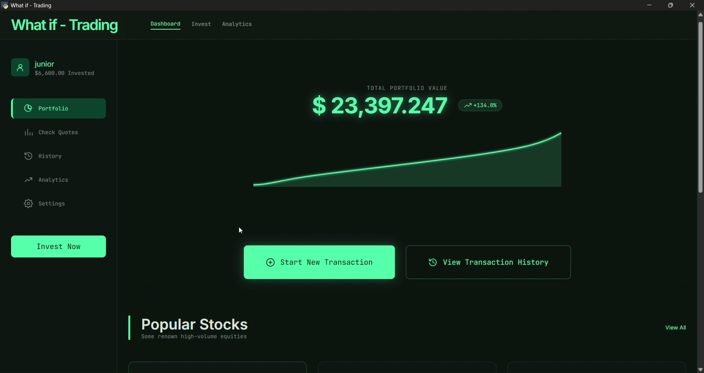
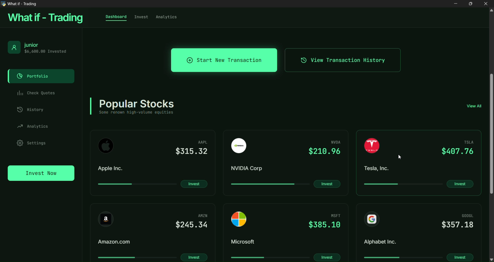
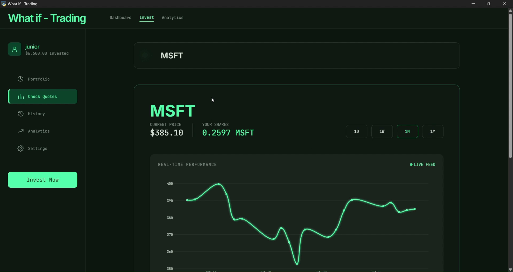
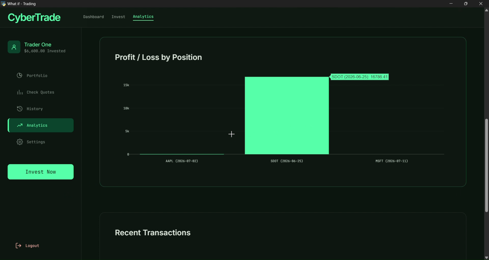
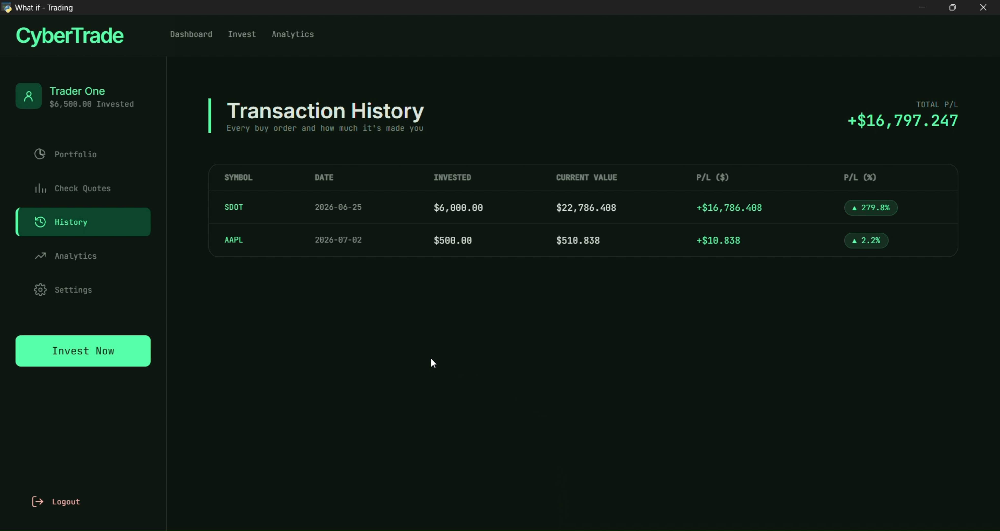

# What if - Trading

This is an app that lets you invest unlimited virtual money on any stock you want and see it grow with time.
The goal is to help new investors see how their portfolio would have grown if they invested when they tought about it.

**What if** - here represents *what if I did it?* 
What if you placed those $200 on S&P500 a few weeks ago. This app lets you see how that transaction would've grown and how your portfolio in general would've grown.

NB: This is not a trading simulation app. You cannot sell the virtaul stocks (you can reset your virtual portfolio though!)


<p align="center">See more pictures at the bottom (^_^)</p>

# Installation instructions (see install.md for a detailed guide)
## Windows
1. Download **`WhatifTrading.zip`** from **[Releases](../../releases)** page of this repository. Extract it, run **`WhatifTrading.exe`** once and then close it (you must do this for proper set up).
2. Get a free API key from the dashboard on **[finnhub.io/register](https://finnhub.io/register)** by creating a free account.
3. Move to the data file by entering the following in your file explorer address bar  
    ```
    %LOCALAPPDATA%\CyberTrade.
    ```
4. open the file named **`.env`**. add your API key to the file by modifying this: finnhub_key=paste_your_key_here
5. You can now re-open the app as it is ready to be used.

## MAC OS
1. Download **`WhatifTrading-macOS.zip`** from **[Releases](../../releases)** page of this repository. Extract it, run **`WhatifTrading.app`** once and then close it (you must do this for proper set up).
2. Get a free API key from the dashboard on **[finnhub.io/register](https://finnhub.io/register)** by creating a free account.
3. Open **Finder**, then in the menu bar click **Go → Go to Folder...**
   (or press `Cmd+Shift+G`), and paste in:
   ```
   ~/Library/Application Support/CyberTrade
   ```
4. open the file named **`.env`** with TextEdit. add your API key to the file by modifying this: finnhub_key=paste_your_key_here
5. You can now re-open the app as it is ready to be used.

<br><br>

# Details
## Why I built this?
I built What If Stocks to help users explore hypothetical investment scenarios while practicing desktop application architecture, local data persistence with SQLite, API integration for market data, and responsive GUI development in Python.

## Running it

```bash
python main.py
```

Make sure you create a database wis.db and it sits in the same directoty as main.py.
The tables are generated automatically by the code.


## Technologies Used
- Python
- JavaScript
- HTML
- CSS

___
- SQLite
- pywebview
- pyinstaller

___

- yfinance
- finnhub-python

___
- Plotly
- Pandas


## Features
- 📊 **Portfolio Dashboard** — live total portfolio value with a
  net-worth sparkline tracking your growth across logins
- 🔍 **Live Stock Search** — look up any ticker by name or symbol via
  Finnhub's live symbol lookup
- 💹 **Real-Time Quotes** — current price + daily % change for any stock,
  powered by Finnhub + yfinance
- 🚀 **Virtual Investing** — "buy" any stock with a virtual dollar
  amount, no real money or brokerage account involved
- 📈 **Interactive Price Charts** — 1D / 1W / 1M / 1Y historical
  performance charts for any symbol
- 🧾 **Transaction History** — every trade you've made, with live
  current value and profit/loss per position
- 📉 **Analytics Dashboard** — total invested, total profit/loss, win
  rate, portfolio growth over time, and P/L broken down by position
- ⭐ **Popular Stocks & Index Funds** — one-click watchlist of trending
  equities (AAPL, NVDA, TSLA, etc.) and major index funds (S&P 500,
  Nasdaq-100, Dow Jones)
- 👤 **Personalized Trader Name** — set your name once, shown across the app
- 💾 **Local & Private** — all data stored locally in SQLite, nothing
  synced to the cloud or sent anywhere


- 🖥️ **Native Desktop App** — packaged as a standalone `.exe` (Windows)
  / `.app` (macOS), no Python installation required to run it
- 🌐 **Fully Offline UI** — fonts, charts, and styling all run locally
  with zero CDN dependency (only live price lookups need internet)


## Project structure

```
main.py                  <- app entry point; fixes the working directory
                             so wis.db resolves correctly
api.py                   <- JS<->Python bridge; the api called by the frontend.
                             Return values into what the frontend expects
.env                     <- copy to .env with your Finnhub key

backend/__init__.py      <- Backend Functions used by the api

frontend/
  dashboard.html/js        Portfolio page
  invest.html/js           Check Quotes / Invest page (search, buy)
  history.html/js          Past transactions + profit/loss
  analytics.html/js        Portfolio growth, P/L by position, tx summary
  settings.html/js         set Trader name, reset portfolio
  
  static/
    css/app.css             compiled Tailwind (offline for .exe purposes, no CDN)
    fonts/                  Inter + JetBrains Mono, bundled locally for .exe purposes
    vendor/plotly.min.js    bundled locally for .exe purposes (no CDN)
    logos                   Stores .png of popular stocks like Apple,...
    js/
      bridge.js              window.pywebview.api.* wrapper (+ browser-preview mocks)
      shell.js               shared top nav + sidebar, rendered on every page
      icons.js                offline SVG icon set
      charts.js               Plotly "glow" chart helpers
```

## take a look



